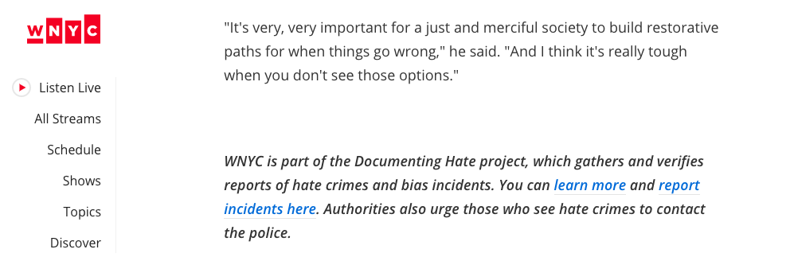

# Incorporating Callouts Into Stories

There are several effective ways to incorporate the tip form into stories that are produced from the project or that are related to the project.

First, any time you or a partner produce a story relevant to the topic of the project, be sure to either write a prominent callout linking to the form, or better yet, embed the form itself at the bottom of the story if the form builder you’re using supports it \(Google’s does\). Ditto for including an on-air callout pointing people to the form online.

When stories relevant to the project are shared on social media, consider composing a thread \(which can even just be two tweets\) in which you promote the tip form in the second or subsequent tweets after the initial story.

When you or partners produce reporting from the project, it's important that the project is referenced, and you can link back to the tip form in those mentions, too.

If there's breaking news about the project, or breaking news about a subject related to your project, you and your partners should consider sharing information about the project on social media with a callout to the form. And while monitoring social media posts about the project or its reporting, be sure to follow up with commenters leaving tips in the comments, pointing them to the tip submission form.

In short, the more often you get the form in front of potential tipsters, the more likely you are to receive a steady stream of tips. And people tend to respond to stories that they recognize in their own experiences, which is why it's important to make it easy for readers to submit tips after reading, listening to or watching a story.

For example, Documenting Hate partner WNYC posts a link to the tip form at the bottom of stories about hate crimes, even when that story didn’t originate as a Documenting Hate tip.

Albert Samaha, a reporter at BuzzFeed News, shares the tip form after his newsroom publishes a story using tips.

 ****  

